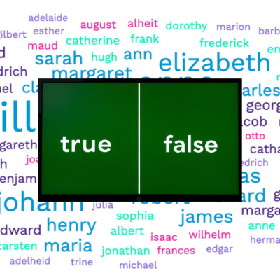

# Name Guesser

## About

**Name Guesser** is a game that attempts to determine whether the name you provide is real or fake by asking a series of questions.

## Inspiration

I was inspired to create **Name Guesser** after playing *Doki Doki Literature Club*, a visual novel with a dark twist. In the game, the character *Monika* 
is shown to be self-aware and, after dismantling the in-game world, "reveals" that she knows your name by reading your computer's username.

While this was a cool feature, its impact was somewhat diminished if the username was something generic like *user1* instead of an actual name like *David*. 
I thought it would be interesting if Monika could subtly gather clues about the player's real name by asking sneaky, indirect questions throughout the game.

**Name Guesser** is my attempt at building such a mechanic — one that gradually pieces together a person's real name through strategic questioning.
